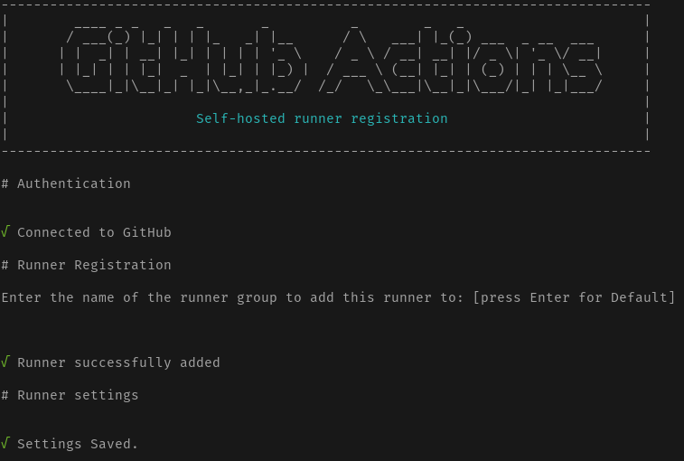
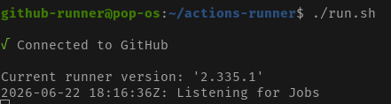

# GitHub Actions Runner no Host Linux

Guia para instalar o GitHub Actions self-hosted runner diretamente no host Linux que executa o Kind.

Essa abordagem evita as limitações do Docker-in-Docker (dind) dentro do Kubernetes, pois o runner roda na máquina host e já tem acesso nativo ao Docker e ao `kubectl`.

---

## Pré-requisitos

- Docker instalado e em execução no host
- `kubectl` configurado com acesso ao cluster Kind
- Acesso ao repositório GitHub com permissão de administrador

---

## 1. Criar um usuário dedicado para o runner (recomendado)

Rodar o runner como `root` é desencorajado. Crie um usuário sem privilégios:

```bash
sudo useradd -m -s /bin/bash github-runner
```

---

## 2. Obter o token de registro no GitHub

1. Acesse o repositório no GitHub
2. Vá em **Settings → Actions → Runners → New self-hosted runner**
3. Selecione **Linux** como sistema operacional
4. Copie os comandos exibidos — eles já incluem o token de registro válido por 1 hora

---

## 3. Baixar e configurar o runner

Execute os comandos abaixo como o usuário `github-runner`:

```bash
sudo su - github-runner

# Create a folder
$ mkdir actions-runner && cd actions-runner

# Download the latest runner package
$ wget https://github.com/actions/runner/releases/download/v2.335.1/actions-runner-linux-x64-2.335.1.tar.gz

# Optional: Validate the hash
$ echo "4ef2f25285f0ae4477f1fe1e346db76d2f3ebf03824e2ddd1973a2819bf6c8cf  actions-runner-linux-x64-2.335.1.tar.gz" | shasum -a 256 -c

# Extract the installer
$ tar xzf ./actions-runner-linux-x64-2.335.1.tar.gz
```

### Configurar com o repositório
```bash
./config.sh \
  --url https://github.com/SEU_ORG/SEU_REPO \
  --token SEU_TOKEN_DE_REGISTRO \
  --name host-runner \
  --labels host,linux \
  --work _work
```

> Os valores `--url` e `--token` são exibidos pelo GitHub na tela de novo runner (passo 2).
> O `--labels` permite identificar esse runner no workflow com `runs-on: kind-host`.


Por fim, vai aparecer algo parecido com isso


Para um teste rápido, execute o runner
```bash
./run.sh
```

---

## 4. Instalar como serviço systemd

Para que o runner inicie automaticamente com o sistema, instale-o como serviço. Execute como `root`:

```bash
sudo /home/github-runner/actions-runner/svc.sh install github-runner
sudo /home/github-runner/actions-runner/svc.sh start
```

Verifique o status:

```bash
sudo /home/github-runner/actions-runner/svc.sh status
# ou
sudo systemctl status actions.runner.*.service
```


---

## 5. Confirmar o registro no GitHub

1. Acesse o repositório no GitHub
2. Vá em **Settings → Actions → Runners**
3. O runner `host-runner` deve aparecer com status **Idle**

---

## 6. Usar o runner em um workflow

Referencie o runner pela label definida no `--labels` durante a configuração:

```yaml
jobs:
  deploy:
    runs-on: kind-host  # label definida no --labels
    steps:
      - uses: actions/checkout@v4
      - name: Verificar nodes do cluster
        run: kubectl get nodes
      - name: Build da imagem
        run: docker build -t minha-app ./app
```

Como o runner roda no host, ele tem acesso direto a:
- `kubectl` com o contexto do cluster Kind já configurado
- `docker` sem necessidade de dind

---

## 7. Remover o runner

Para desregistrar e remover o serviço:

```bash
sudo /home/github-runner/actions-runner/svc.sh stop
sudo /home/github-runner/actions-runner/svc.sh uninstall github-runner

sudo su - github-runner
cd ~/actions-runner
./config.sh remove --token SEU_TOKEN_DE_REGISTRO
```

---

## Referências

- [Documentação oficial — self-hosted runners](https://docs.github.com/en/actions/hosting-your-own-runners/managing-self-hosted-runners/about-self-hosted-runners)
- [Releases do actions/runner](https://github.com/actions/runner/releases)
- [Kind — carregar imagens locais](https://kind.sigs.k8s.io/docs/user/quick-start/#loading-an-image-into-your-cluster)
